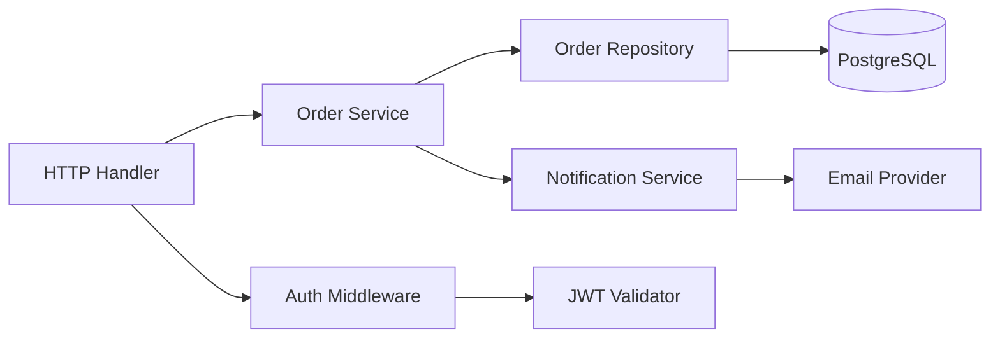
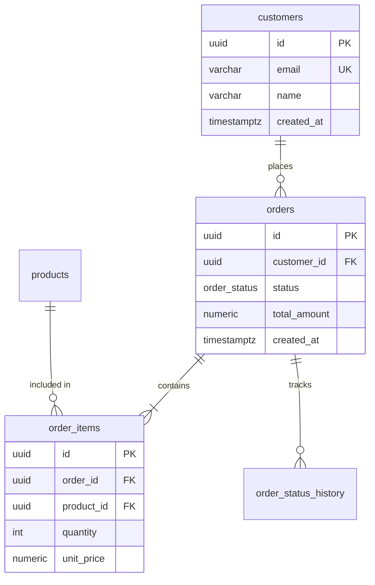

# Effective Software Development with Claude Code

**A Practitioner's Guide to AI-Assisted Planning, Implementation, CI/CD, and Infrastructure**

*Technical Whitepaper — March 2026*

---

## Table of Contents

- [Executive Summary](#executive-summary)
- [Prerequisites](#prerequisites)
- [Introduction](#introduction)
  - [The Problem with Naive AI-Assisted Development](#the-problem-with-naive-ai-assisted-development)
  - [The Metadata-First Approach](#the-metadata-first-approach)
  - [What This Whitepaper Covers](#what-this-whitepaper-covers)
- [Configuring Claude Code for Production Use](#configuring-claude-code-for-production-use)
  - [The CLAUDE.md Hierarchy](#the-claudemd-hierarchy)
  - [Settings and Permissions](#settings-and-permissions)
  - [Memory Files for Evolving Context](#memory-files-for-evolving-context)
- [The Metadata Generation Workflow](#the-metadata-generation-workflow)
  - [Phase 1: Architecture Discovery with Plan Mode](#phase-1-architecture-discovery-with-plan-mode)
  - [Phase 2: Interface Contract Generation](#phase-2-interface-contract-generation)
  - [Phase 3: Implementation Checklist Generation](#phase-3-implementation-checklist-generation)
- [Implementation Patterns](#implementation-patterns)
  - [Prompting with Context References](#prompting-with-context-references)
  - [Subagent Delegation for Parallel Work](#subagent-delegation-for-parallel-work)
  - [Iterative Refinement with Test Feedback](#iterative-refinement-with-test-feedback)
  - [Working with Existing Codebases](#working-with-existing-codebases)
  - [Database Schema Development](#database-schema-development)
- [Web Application Development](#web-application-development)
  - [Backend API Development](#backend-api-development)
  - [Frontend Development](#frontend-development)
  - [Full-Stack Coordination](#full-stack-coordination)
- [CI/CD Integration](#cicd-integration)
  - [GitHub Actions: Claude Code as Automated Reviewer](#github-actions-claude-code-as-automated-reviewer)
  - [Headless Mode for Pipeline Tasks](#headless-mode-for-pipeline-tasks)
  - [Cost and Performance Management](#cost-and-performance-management)
- [Infrastructure as Code](#infrastructure-as-code)
  - [Terraform with Claude Code](#terraform-with-claude-code)
  - [AWS CDK with Claude Code](#aws-cdk-with-claude-code)
- [Playbooks](#playbooks) (9 end-to-end walkthroughs, collapsible)
- [Hooks and Automation Recipes](#hooks-and-automation-recipes)
- [Best Practices and Anti-Patterns](#best-practices-and-anti-patterns)
- [Appendix A: Quick Reference Card](#appendix-a-quick-reference-card)
- [Appendix B: CLAUDE.md Templates](#appendix-b-claudemd-templates)

---

## Executive Summary

Claude Code is a CLI-based AI development tool that operates directly in your terminal with full access to your project context—files, git history, environment, and toolchain. Unlike chat-based AI assistants that require manual copy-paste of code snippets, Claude Code reads your codebase, executes commands, edits files, and integrates with your existing development workflow.

This whitepaper presents a **metadata-first methodology** for using Claude Code in production software development. The core thesis: the quality of AI-assisted implementation is directly proportional to the quality of the structured context you provide. By investing in upfront planning and metadata generation—architecture decision records, interface contracts, dependency maps, and project conventions—you create a feedback loop where Claude Code produces increasingly accurate, consistent, and production-ready output.

We cover the full development lifecycle: planning and discovery, implementation, web application development (backend and frontend), CI/CD pipeline integration, and infrastructure as code. Each section includes concrete examples and executable playbooks that you can adapt to your own projects.

**Key takeaways:**

- A 30-minute investment in metadata generation saves hours of iterative correction during implementation
- `CLAUDE.md` files and structured project context are the single highest-leverage configuration you can make
- Claude Code's plan mode, subagents, and headless mode enable workflows from interactive development to fully automated CI/CD
- Web application development—both backend APIs and frontend SPAs—benefits from component-level metadata generation and interface-first design
- Infrastructure as Code benefits enormously from metadata-driven prompting because of the declarative, well-documented nature of Terraform and CloudFormation

## Prerequisites

This guide assumes you have:

- **Claude Code installed** and authenticated (`npm install -g @anthropic-ai/claude-code`)
- **Basic familiarity** with running Claude Code interactively (`claude` in your terminal)
- **A software project** you want to apply these techniques to—the examples use Go, TypeScript, and Python, but the methodology is language-agnostic

No prior experience with `CLAUDE.md`, plan mode, or headless mode is required—those are covered in detail below.

## Introduction

### The Problem with Naive AI-Assisted Development

The most common failure mode with AI coding assistants is the "blank prompt" approach: opening a tool and typing "build me a REST API." The result is generic code that doesn't match your project's conventions, uses the wrong libraries, targets the wrong runtime, and requires extensive manual correction. Each correction cycle wastes context window tokens and developer time.

This happens because the AI lacks **project-specific context**. It doesn't know your team uses Go with Chi router instead of Gin. It doesn't know your CI pipeline runs on GitHub Actions with a specific linting configuration. It doesn't know your infrastructure lives in Terraform with a particular module structure.

### The Metadata-First Approach

This whitepaper introduces a structured methodology where you **generate and maintain metadata artifacts** that serve as persistent context for Claude Code. These artifacts include:

| Artifact | Purpose | Example |
|----------|---------|---------|
| `CLAUDE.md` | Project conventions, build commands, architecture | "Use Go 1.22, Chi router, sqlc for queries" |
| Architecture Decision Records | Design rationale and constraints | "ADR-003: Use event sourcing for order service" |
| Interface Contracts | API schemas, protobuf definitions | OpenAPI spec, `.proto` files |
| Dependency Maps | Service relationships and data flow | Mermaid diagrams in markdown |
| Implementation Checklists | Step-by-step task breakdowns | Generated from plan mode sessions |

These artifacts are both **human-readable documentation** and **machine-consumable context**. They serve double duty: onboarding new engineers and providing Claude Code with the structured information it needs to generate accurate implementations.

### What This Whitepaper Covers

- **[Configuring Claude Code for Production Use](#configuring-claude-code-for-production-use)**—`CLAUDE.md`, settings, permissions, and memory
- **[The Metadata Generation Workflow](#the-metadata-generation-workflow)**—how to create high-quality context before writing code
- **[Implementation Patterns](#implementation-patterns)**—effective prompting, subagent delegation, and iterative refinement
- **[Web Application Development](#web-application-development)**—backend APIs, frontend SPAs, and full-stack patterns
- **[CI/CD Integration](#cicd-integration)**—GitHub Actions, automated review, headless pipelines
- **[Infrastructure as Code](#infrastructure-as-code)**—Terraform and AWS CDK with Claude Code
- **[Playbooks](#playbooks)**—end-to-end walkthroughs for common scenarios

## Configuring Claude Code for Production Use

Before writing a single line of code, proper configuration determines the quality ceiling of everything Claude Code produces. This section covers the configuration hierarchy and practical setup patterns.

### The CLAUDE.md Hierarchy

Claude Code loads instructions from multiple `CLAUDE.md` files in a specific priority order:

```text
~/.claude/CLAUDE.md              # User-wide defaults (your personal preferences)
./CLAUDE.md                      # Project root (team conventions, shared)
./.claude/CLAUDE.md              # Alternative project location
./CLAUDE.local.md                # Local overrides (gitignored, personal)
./src/CLAUDE.md                  # Subdirectory (loaded when Claude reads files here)
./.claude/rules/*.md             # Modular rule files
```

> [!IMPORTANT]
> The project-root `CLAUDE.md` is the single highest-impact configuration you can create. It is loaded in full at the start of every session and directly shapes every response Claude Code generates.

#### Effective CLAUDE.md Structure

A production `CLAUDE.md` should be under 200 lines and cover these categories:

```markdown
# Project: order-service

## Build & Test
- Language: Go 1.22
- Build: `go build ./cmd/server`
- Test: `go test ./... -race -count=1`
- Lint: `golangci-lint run`
- DB migrations: `goose -dir migrations postgres "$DATABASE_URL" up`

## Architecture
- Clean architecture: handlers -> services -> repositories
- All business logic in `internal/service/`
- Database access only through `internal/repository/`
- HTTP handlers in `internal/handler/` using Chi router
- Config via environment variables, parsed in `internal/config/`

## Code Conventions
- Errors: use `fmt.Errorf("operation: %w", err)` wrapping pattern
- Context: pass `context.Context` as first parameter to all service/repo methods
- Logging: use `slog` structured logging, no `log.Printf`
- Tests: table-driven tests with `t.Run()` subtests
- Naming: `NewServiceName()` constructors, `ServiceNameOption` for functional options

## Database
- PostgreSQL 16, managed via sqlc
- Queries in `queries/*.sql`, generated code in `internal/db/`
- Run `sqlc generate` after modifying queries
- Migrations use goose, sequential numbering

## API
- REST API with OpenAPI 3.1 spec in `api/openapi.yaml`
- Request/response types generated from OpenAPI spec
- All endpoints require authentication via JWT middleware
- Pagination: cursor-based, not offset-based

## Dependencies
- Chi v5 for routing
- sqlc for type-safe SQL
- goose for schema migrations
- testcontainers-go for integration tests
```

> [!WARNING]
> **What NOT to put in CLAUDE.md:**
> - Generic advice ("write clean code")—be specific or omit it
> - Lengthy tutorials or explanations—link to docs instead
> - Frequently changing information—use memory files for volatile data
> - Secrets or credentials—use environment variables

### Settings and Permissions

Project settings in `.claude/settings.json` control tool access and behavior:

```json
{
  "permissions": {
    "allow": [
      "Read",
      "Glob",
      "Grep",
      "Bash(go build ./...)",
      "Bash(go test ./...)",
      "Bash(golangci-lint run)",
      "Bash(sqlc generate)",
      "Bash(goose *)",
      "Bash(git *)",
      "Bash(gh *)",
      "Bash(make *)"
    ],
    "deny": [
      "Bash(rm -rf *)",
      "Read(.env*)",
      "Read(*credentials*)"
    ]
  }
}
```

This configuration pre-approves common development commands while blocking destructive operations. The result: fewer permission prompts interrupting your flow, with guardrails on dangerous actions.

### Memory Files for Evolving Context

Claude Code's auto-memory (`~/.claude/projects/<project>/memory/`) captures learnings across sessions. But you can also **seed memory intentionally** to front-load context:

```markdown
# MEMORY.md (auto-loaded, keep under 200 lines)

## Project State
- Current sprint: implementing order history endpoint
- Database schema v14 is deployed to staging
- PR #234 introduced the new pagination helper in `internal/pagination/`

## Known Issues
- Integration tests require Docker running (testcontainers)
- The `order_items` table has a composite index that sqlc doesn't detect automatically
- CI flakes on `TestWebhookDelivery` due to timing; use `retry` wrapper

## Patterns Discovered
- See [api-patterns.md](api-patterns.md) for handler boilerplate
- See [testing-patterns.md](testing-patterns.md) for integration test setup
```

Memory files bridge sessions. When you discover that a particular test requires a specific environment variable or that a certain API endpoint has an undocumented constraint, record it in memory so future sessions start with that knowledge.

## The Metadata Generation Workflow

> [!TIP]
> This section describes the core methodology: generating structured metadata *before* implementation. This is where the highest ROI exists in AI-assisted development.

### Phase 1: Architecture Discovery with Plan Mode

Plan mode (`Shift+Tab` in the terminal, or `claude --permission-mode plan`) restricts Claude Code to read-only operations. It can explore your codebase, analyze patterns, and generate plans without modifying anything.

#### Discovery Session Pattern

Start every significant feature or change with a discovery session:

```bash
# Enter Claude Code in plan mode
claude --permission-mode plan
```

Then prompt for structured analysis:

```text
Analyze this codebase and produce the following artifacts:

1. DEPENDENCY MAP: A list of all services/packages and their
   relationships. Format as a Mermaid graph.

2. INTERFACE INVENTORY: All public APIs, including HTTP endpoints,
   gRPC services, and internal package interfaces. Include method
   signatures and brief descriptions.

3. CONVENTION REPORT: Observed patterns for error handling, logging,
   testing, and configuration. Include file paths as evidence.

4. GAP ANALYSIS: For the feature "order history with filtering and
   pagination", identify which existing patterns can be reused and
   what new components are needed.
```

This produces structured output that becomes your implementation roadmap. The convention report is particularly valuable—it tells Claude Code (and you) exactly how to implement new code that matches existing patterns.

For example, a dependency map generated by Claude Code might look like this (GitHub renders Mermaid natively):



Store these artifacts in your repository (e.g., `docs/architecture/`) so Claude Code can reference them in future sessions.

#### Generating Architecture Decision Records

ADRs capture the *why* behind technical choices. They're invaluable context for Claude Code because they explain constraints that aren't visible in the code itself.

```text
Based on your analysis, generate an ADR for the following decision:

Title: Use cursor-based pagination for order history
Context: [describe the situation]
Decision: [what was decided]
Consequences: [tradeoffs]

Format as ADR-NNN following the template in docs/adr/
```

Example output that Claude Code generates:

```markdown
# ADR-007: Cursor-Based Pagination for Order History

## Status
Accepted

## Context
The order history endpoint needs to support pagination for users
with thousands of orders. We evaluated offset-based and cursor-based
pagination.

Offset pagination (`LIMIT/OFFSET`) degrades at scale—`OFFSET 10000`
still scans 10,000 rows. Our orders table is append-heavy and will
grow to millions of rows per tenant.

## Decision
Use cursor-based pagination with the `created_at` timestamp and
`order_id` as the cursor compound key. The cursor is opaque to
clients (base64-encoded).

## Consequences
- Consistent O(1) pagination performance regardless of page depth
- Cannot jump to arbitrary pages (no "page 47 of 200")
- Requires a stable sort order (created_at DESC, order_id DESC)
- Cursor must be validated server-side to prevent injection
- Existing `internal/pagination/cursor.go` helper can be reused
```

This ADR, stored in your repository, becomes context that Claude Code uses in future sessions when implementing pagination-related features.

### Phase 2: Interface Contract Generation

Before implementing a feature, define its interfaces. This is metadata that constrains implementation to produce correct results.

#### OpenAPI Spec Generation

```text
Generate an OpenAPI 3.1 specification for the order history endpoint
with these requirements:

- GET /api/v1/orders
- Query parameters: status (enum: pending, completed, cancelled),
  date_from, date_to, cursor, limit (default 20, max 100)
- Response: paginated list of orders with next_cursor
- Auth: Bearer JWT token
- Error responses: 400, 401, 403, 500

Follow the existing patterns in api/openapi.yaml. Match the response
envelope structure used by other endpoints.
```

#### Database Schema Generation

```text
Generate a SQL migration for the order history feature:

- New index on orders table for (tenant_id, status, created_at DESC)
- Follow the existing migration pattern in migrations/
- Use goose format with sequential numbering
- Include both up and down migrations
```

#### Interface Definition

```text
Define the Go interfaces for the order history feature following
the existing clean architecture pattern:

1. Repository interface in internal/repository/order.go
2. Service interface in internal/service/order.go
3. Handler registration in internal/handler/order.go

Only define the interfaces and method signatures. Do not implement
the methods yet. Include godoc comments describing each method's
contract, parameters, and error conditions.
```

### Phase 3: Implementation Checklist Generation

After discovery and interface definition, generate a detailed implementation checklist. This becomes the execution plan.

```text
Based on the ADR, OpenAPI spec, migration, and interfaces we've
defined, generate a step-by-step implementation checklist. For each
step, include:

1. The specific file(s) to create or modify
2. What to implement (be precise about function names and logic)
3. How to verify the step is complete (test command or manual check)
4. Dependencies on other steps

Output as a numbered markdown checklist.
```

Example output:

```markdown
## Implementation Checklist: Order History Feature

### Database Layer
- [ ] 1. Create migration `migrations/000015_add_order_history_index.sql`
  - Add composite index: `(tenant_id, status, created_at DESC, id DESC)`
  - Verify: `goose -dir migrations postgres "$DATABASE_URL" up`

- [ ] 2. Add query in `queries/orders.sql`
  - `ListOrdersByTenant` with cursor pagination and optional status filter
  - Verify: `sqlc generate` succeeds without errors

- [ ] 3. Verify generated code in `internal/db/orders.sql.go`
  - Confirm generated types match expected interface
  - Verify: `go build ./internal/db/...`

### Repository Layer
- [ ] 4. Implement `OrderRepository.ListByTenant()` in
       `internal/repository/order.go`
  - Decode cursor, execute query, encode next cursor
  - Verify: `go test ./internal/repository/... -run TestListByTenant`

### Service Layer
- [ ] 5. Implement `OrderService.GetHistory()` in
       `internal/service/order.go`
  - Validate pagination params, call repository, map to response DTOs
  - Verify: `go test ./internal/service/... -run TestGetHistory`

### Handler Layer
- [ ] 6. Implement `OrderHandler.ListOrders()` in
       `internal/handler/order.go`
  - Parse query params, call service, render paginated JSON response
  - Register route: `r.Get("/api/v1/orders", h.ListOrders)`
  - Verify: `go test ./internal/handler/... -run TestListOrders`

### Integration
- [ ] 7. Add integration test in `tests/integration/order_history_test.go`
  - Test full flow: create orders -> paginate -> verify cursor behavior
  - Verify: `go test ./tests/integration/... -run TestOrderHistoryIntegration`

- [ ] 8. Update OpenAPI spec `api/openapi.yaml` (already drafted)
  - Verify: `oapi-codegen -verify api/openapi.yaml`
```

This checklist is the bridge between planning and implementation. Each step is specific enough that Claude Code can execute it independently, and each has a verification command so you can confirm correctness before moving to the next step.

## Implementation Patterns

With metadata in place, implementation becomes a series of constrained, verifiable steps rather than open-ended code generation.

### Prompting with Context References

The most effective implementation prompts reference the metadata you've already created:

```text
Implement step 4 from the implementation checklist: OrderRepository.ListByTenant()

Context:
- The sqlc-generated types are in internal/db/orders.sql.go
- The cursor pagination helper is in internal/pagination/cursor.go
- Follow the existing repository pattern in internal/repository/user.go
- The interface contract is defined in internal/repository/interfaces.go

Implement the method body. Run the tests when done.
```

This prompt is effective because:

1. **Specific scope**: one method, one file
2. **Context references**: points to existing patterns and generated code
3. **Verification**: "run the tests when done" gives Claude Code a success criterion

### Subagent Delegation for Parallel Work

Claude Code's subagent system enables parallel task execution. Use this for independent implementation steps:

```text
I need to implement steps 4, 5, and 6 from the checklist in parallel.
Each is independent—the service can use the repository interface,
and the handler can use the service interface, even before the
implementations are complete.

Launch three agents:
- Agent 1: Implement OrderRepository.ListByTenant (step 4)
- Agent 2: Implement OrderService.GetHistory (step 5)
- Agent 3: Implement OrderHandler.ListOrders (step 6)

Each agent should run tests for its layer when done.
```

Claude Code will spawn subagents that work in isolated contexts, producing implementations in parallel. This is particularly effective for clean architecture projects where layers communicate through interfaces.

### Iterative Refinement with Test Feedback

When tests fail, provide the failure output as context for the fix:

```text
The integration test is failing with this output:

--- FAIL: TestOrderHistoryIntegration/pagination_returns_correct_cursor
    order_history_test.go:87: expected next_cursor to be non-empty
    for first page, got ""

The cursor encoding in internal/pagination/cursor.go uses base64.
Check if the repository is correctly passing the last row's
(created_at, id) tuple to the cursor encoder.
```

This is more effective than "fix the test" because it narrows the search space and points Claude Code toward the likely root cause.

### Working with Existing Codebases

For brownfield projects, the discovery phase is critical. Use the Explore subagent for codebase analysis:

```text
Before making any changes, I need you to understand how authentication
works in this codebase. Search for:

1. Where JWT tokens are validated (middleware)
2. How the user context is extracted from the token
3. How other handlers access the authenticated user
4. Any role-based access control patterns

Produce a summary with file paths and line numbers.
```

This produces a map of the existing auth system that Claude Code uses as context for any auth-related implementation, preventing it from reimplementing patterns that already exist.

### Database Schema Development

Database schema work is where upfront metadata pays compound returns—every table, index, and constraint you define correctly in the planning phase prevents cascading errors through the repository, service, and handler layers above it.

#### Schema Design with Entity-Relationship Metadata

Start by generating a structured entity-relationship document before writing any SQL:

```text
Design the database schema for an order management system.

Entities and relationships:
- Customer (1) → (many) Order
- Order (1) → (many) OrderItem
- Product (1) → (many) OrderItem
- Order (1) → (many) OrderStatusHistory

For each entity, define:
1. Table name (snake_case, plural)
2. All columns with: name, type, nullable, default, constraints
3. Primary key strategy (UUID v7 for sortable IDs, or BIGSERIAL)
4. Foreign keys with ON DELETE behavior (CASCADE, SET NULL, RESTRICT)
5. Unique constraints and check constraints
6. Created/updated timestamps with timezone

Normalization requirements:
- 3NF minimum, denormalize only with explicit justification
- Money fields use NUMERIC(12,2), not FLOAT
- Status fields use PostgreSQL ENUMs defined as separate types
- All text fields have explicit max length via CHECK constraints

Output as a SQL DDL script with comments explaining each design decision.
```

Pair this with a Mermaid ER diagram for visual reference:

```text
Generate a Mermaid ER diagram for the schema you just designed.
Use the erDiagram syntax with relationship cardinality labels.
Include the key columns in each entity box.
```

This produces a diagram Claude Code can reference in future sessions:



#### Migration Workflow Patterns

**Initial schema generation:**

```text
Generate a database migration for the order management schema.

Migration tool: goose (Go) / Drizzle Kit (TypeScript) / Alembic (Python)
Convention: sequential numbering, descriptive names
Location: migrations/ (or drizzle/ or alembic/versions/)

Requirements:
- Separate migration per logical group (users, orders, indexes)
- Every migration MUST include a rollback (down migration)
- Use IF NOT EXISTS for idempotent index creation
- Create ENUMs as separate types before the tables that use them
- Add comments on columns that aren't self-documenting

Verify each migration applies cleanly against an empty database
and rolls back without errors.
```

**Iterative schema changes (the common case):**

```text
I need to add a "shipping_address" to orders. Generate a migration that:

1. Creates an addresses table (street, city, state, postal_code, country)
2. Adds a shipping_address_id FK to the orders table
3. Backfills existing orders with a NULL shipping address
4. Does NOT make the FK non-nullable yet (that's a separate migration
   after backfill is confirmed in production)

Follow the existing migration pattern in migrations/.
Include the down migration that reverses each step in order.
```

> [!TIP]
> Always separate additive changes (new columns, new tables) from constraint tightening (adding NOT NULL, dropping columns). This makes rollbacks safe and allows zero-downtime deployments.

#### Query Layer Generation

The query layer is where schema metadata meets application code. Different ORMs and query builders need different prompts:

**sqlc (Go) — SQL-first, type-safe:**

```text
Generate sqlc queries for the orders table in queries/orders.sql.

Required operations:
- ListByCustomer: cursor pagination with status filter
- GetByID: single order with items (use a CTE or separate query)
- Create: insert order + items in a single transaction
- UpdateStatus: with optimistic locking (WHERE status = $current_status)
- SoftDelete: set deleted_at, don't remove the row

Follow the existing query patterns in queries/users.sql.
Use sqlc annotations (-- name: QueryName :many/:one/:exec).
After generating, run `sqlc generate` and verify the output compiles.
```

**Drizzle ORM (TypeScript) — schema-as-code:**

```text
Generate the Drizzle ORM schema for the order management tables
in src/db/schema/orders.ts.

Map the SQL types:
- UUID → uuid() with defaultRandom()
- NUMERIC(12,2) → numeric({ precision: 12, scale: 2 })
- ENUM → pgEnum() defined at the top of the file
- TIMESTAMPTZ → timestamp({ withTimezone: true, mode: 'date' })

Include:
- Relations using the relations() helper
- Inferred types: export type Order = typeof orders.$inferSelect
- Insert types: export type NewOrder = typeof orders.$inferInsert

Follow the existing schema pattern in src/db/schema/users.ts.
Run `pnpm drizzle-kit generate` to create the migration.
```

**Prisma (TypeScript) — schema-first:**

```text
Add the order management models to prisma/schema.prisma.

Follow the existing conventions:
- Model names: PascalCase singular (Order, not orders)
- Field names: camelCase
- Use @map/@@@map for snake_case table/column names
- Enum definitions above the models that use them
- Relation names on both sides of every relationship
- @@index for query-pattern indexes (see below)

After updating the schema:
1. Run `npx prisma migrate dev --name add_orders`
2. Run `npx prisma generate`
3. Verify the client types are correct
```

**SQLAlchemy (Python) — mapped classes:**

```text
Generate SQLAlchemy 2.0 mapped classes for the order management
tables in app/models/order.py.

Use the DeclarativeBase with Mapped[] type annotations:
- Mapped[uuid.UUID] for UUIDs
- Mapped[Decimal] for money fields
- Mapped[OrderStatus] for the enum (define with Python enum + SQLAlchemy Enum)
- Mapped[datetime] with server_default=func.now()

Include:
- Relationship() with back_populates on both sides
- __tablename__ matching the SQL table name
- Repr with key fields only (no sensitive data)

Follow the pattern in app/models/user.py.
Run `alembic revision --autogenerate -m "add orders"` and review
the generated migration before applying.
```

#### Index and Performance Metadata

Indexes are where most schema performance problems live. Give Claude Code your query patterns upfront:

```text
Review the order management schema and generate indexes based on
these query patterns:

1. List orders by customer, sorted by created_at DESC (most common)
2. Filter orders by status within a date range
3. Look up order items by order_id (always fetched together)
4. Search orders by customer email (JOIN through customers table)
5. Dashboard: count orders by status for a given date range

For each index, provide:
- CREATE INDEX statement with CONCURRENTLY option
- Which query it serves (reference by number above)
- Estimated selectivity and why this index helps
- Whether it should be a partial index (e.g., WHERE deleted_at IS NULL)
- Storage cost tradeoff (wide indexes on large tables)

Put these in a dedicated migration: migrations/000016_add_order_indexes.sql
Include the down migration (DROP INDEX CONCURRENTLY).
```

> [!NOTE]
> Include `CONCURRENTLY` in index creation for production databases—Claude Code won't add it by default since it's a PostgreSQL-specific extension to standard SQL.

#### Seed Data and Test Fixtures

Realistic seed data makes development and testing more effective:

```text
Generate a database seed script for local development.

Requirements:
- 3 customers with different order histories:
  - "Active Customer": 50 orders across all statuses, spanning 6 months
  - "New Customer": 2 orders, both pending, created today
  - "Churned Customer": 10 orders, all completed, last one 1 year ago
- Realistic product catalog: 20 products across 4 categories
- Order items: 1-5 items per order, realistic quantities and prices
- Use deterministic IDs (UUID v5 from names) so seeds are idempotent

Format:
- For Go/sqlc: a Go file using the generated queries
- For Drizzle: a TypeScript seed file using the schema
- For SQLAlchemy: a Python script using the models

The seed should be runnable with a single command (document it in CLAUDE.md).
Also generate a minimal fixture set for integration tests: 1 customer,
1 order, 2 items—just enough to test the happy path without slow setup.
```

## Web Application Development

Web applications are where the metadata-first approach pays the highest dividends. Backend APIs and frontend SPAs each have distinct metadata needs—route definitions, data models, component hierarchies, state management patterns—and Claude Code handles both when given proper context. This section covers backend and frontend development individually, then shows how to coordinate them in a full-stack workflow.

### Backend API Development

#### Metadata Artifacts for Backend Services

Before generating any backend code, produce these artifacts:

**1. Route Map**

A route map is a structured inventory of every endpoint, its HTTP method, authentication requirements, and request/response shapes. This becomes the single source of truth for both implementation and frontend integration.

```text
Analyze the existing routes in this codebase and produce a route map
in this format:

| Method | Path | Auth | Request Body | Response | Handler | Status |
|--------|------|------|-------------|----------|---------|--------|
| GET | /api/v1/users | JWT | - | User[] | UserHandler.List | exists |
| POST | /api/v1/users | JWT+Admin | CreateUserReq | User | UserHandler.Create | exists |
| ... | ... | ... | ... | ... | ... | ... |

Include both existing and planned routes. Mark planned routes
as "planned" in the Status column.
```

**2. Data Model Registry**

```text
Generate a data model registry for this project. For each model:

1. Name and database table
2. All fields with types, constraints, and defaults
3. Relationships (belongs_to, has_many, many_to_many)
4. Indexes (existing and recommended)
5. Validation rules (required, unique, format, range)
6. Which API endpoints expose this model
7. Any computed/virtual fields

Format as structured markdown. Include both the database
representation and the API representation (they often differ—
internal fields like password_hash shouldn't appear in API responses).
```

**3. Middleware Chain Documentation**

```text
Document the middleware chain for this application:

1. Global middleware (applied to all routes)
2. Group-level middleware (applied to route groups)
3. Per-route middleware
4. Execution order

For each middleware, document:
- What it does
- What it adds to the request context
- What conditions cause it to short-circuit the request
- Configuration parameters

This is critical context—when I implement new routes, I need to
know what's already handled by middleware (auth, CORS, rate limiting,
request ID, logging) vs. what the handler must do itself.
```

#### Backend Implementation Pattern: Feature Slice

Rather than implementing layer-by-layer across the entire feature, implement **vertical slices**—one complete endpoint at a time, from route to database and back:

```text
Implement the POST /api/v1/products endpoint as a complete vertical slice.

Route map entry:
- Method: POST
- Path: /api/v1/products
- Auth: JWT + role:admin
- Request: { name: string, sku: string, price: number, category_id: uuid }
- Response: 201 { product } | 400 { errors } | 409 { error: "SKU exists" }

Implementation order:
1. Migration: products table with unique SKU constraint
2. Model: Product struct with validation tags
3. Repository: Create method with conflict detection
4. Service: CreateProduct with business validation (price > 0, valid category)
5. Handler: Parse request, call service, render response
6. Route: Register in router with admin middleware
7. Test: Unit test for service, integration test for full flow

Use the existing User endpoint as the reference implementation.
Run tests after each sub-step.
```

This slice-based approach produces a working endpoint that can be manually tested before moving to the next endpoint. It also gives Claude Code a complete reference for subsequent endpoints.

#### Backend: Express/Node.js Example

For Node.js backends, the metadata-first approach adapts to the ecosystem's conventions:

```markdown
# CLAUDE.md for Node.js Backend

## Build & Run
- Runtime: Node.js 20 LTS, TypeScript 5.4
- Package manager: pnpm
- Build: `pnpm build` (tsc)
- Dev: `pnpm dev` (tsx watch)
- Test: `pnpm test` (vitest)
- Lint: `pnpm lint` (eslint + prettier)
- DB: `pnpm db:migrate` (drizzle-kit push)

## Architecture
- Framework: Express 5 with async error handling
- Validation: Zod schemas (shared between request validation and OpenAPI generation)
- ORM: Drizzle ORM with PostgreSQL
- Auth: Passport.js with JWT strategy
- Structure:
  - `src/routes/` - Express routers, one file per resource
  - `src/middleware/` - Auth, validation, error handling
  - `src/services/` - Business logic (no Express types)
  - `src/db/` - Drizzle schema and queries
  - `src/schemas/` - Zod schemas for request/response validation
  - `src/types/` - Shared TypeScript types

## Conventions
- Every route handler is wrapped in asyncHandler() - never use try/catch in handlers
- Zod schemas are the single source of truth for validation and types
- Services accept plain objects, not Express Request objects
- All database queries go through Drizzle - no raw SQL
- Error responses use ProblemDetails format (RFC 9457)
- Tests use supertest for HTTP testing, testcontainers for DB
```

**Zod Schema as Metadata:**

Zod schemas serve as both runtime validation and compile-time types, making them ideal metadata artifacts for Claude Code:

```text
Generate Zod schemas for the product resource:

1. CreateProductSchema - request body validation
2. UpdateProductSchema - partial update (all fields optional)
3. ProductQuerySchema - query parameters (filters, pagination)
4. ProductResponseSchema - API response shape
5. ProductDBSchema - database row shape (superset of response)

Put schemas in src/schemas/product.ts. Derive TypeScript types
using z.infer<>. These schemas will be used by:
- Route handlers for request validation
- Service layer for type safety
- OpenAPI generation (zod-to-openapi)
- Frontend API client types (shared via package)
```

#### Backend: Python/FastAPI Example

FastAPI's Pydantic models serve the same dual-purpose metadata role:

```text
Generate the FastAPI application structure for an order management API:

1. app/models/order.py - SQLAlchemy models (Order, OrderItem)
2. app/schemas/order.py - Pydantic schemas:
   - OrderCreate (request)
   - OrderUpdate (partial update)
   - OrderResponse (API response, excludes internal fields)
   - OrderListResponse (paginated collection)
   - OrderFilter (query parameters)
3. app/api/routes/orders.py - Route definitions with type annotations
4. app/services/order.py - Business logic with OrderService class
5. app/db/repositories/order.py - Database operations

FastAPI's automatic OpenAPI generation means the Pydantic schemas
ARE the API documentation. Make them thorough:
- Field descriptions for every attribute
- Examples in model_config
- Proper status codes on each route
- Dependency injection for auth and DB sessions

Follow the existing user resource at app/api/routes/users.py
as the pattern.
```

### Frontend Development

Frontend development with Claude Code requires a different metadata strategy. Instead of API contracts and database schemas, the key artifacts are **component hierarchies**, **state management maps**, and **design system tokens**.

#### Metadata Artifacts for Frontend

**1. Component Tree**

```text
Analyze this React application and produce a component tree:

For each component:
- File path and export name
- Props interface (with types)
- State it manages (local useState/useReducer)
- Global state it consumes (context, Redux, Zustand)
- API calls it makes (or hooks it uses that make API calls)
- Child components it renders
- Route it's mounted on (if it's a page component)

Format as an indented tree with metadata. Example:
App
├── Layout (layout.tsx)
│   ├── Sidebar - props: { collapsed: boolean }
│   │   ├── NavItem - props: { icon, label, href, active }
│   │   └── UserMenu - consumes: AuthContext
│   └── MainContent - props: { children }
├── Pages
│   ├── Dashboard (pages/dashboard.tsx) - route: /
│   │   ├── StatsGrid - fetches: GET /api/stats
│   │   ├── RecentOrders - fetches: GET /api/orders?limit=5
│   │   └── ActivityFeed - consumes: WebSocketContext
│   ...
```

**2. State Management Map**

```text
Document all state management in this application:

1. GLOBAL STATE (Zustand/Redux/Context):
   - Store name, location, shape (TypeScript interface)
   - Actions/mutations available
   - Which components subscribe to which slices
   - Persistence (localStorage, sessionStorage, none)

2. SERVER STATE (React Query/SWR/Apollo):
   - Query keys and their fetch functions
   - Cache invalidation rules
   - Optimistic update patterns
   - Prefetching strategies

3. URL STATE:
   - Search params used for filtering/pagination
   - Which components read/write URL state
   - Sync patterns between URL and component state

4. FORM STATE:
   - Form library (React Hook Form, Formik, native)
   - Validation schemas (Zod, Yup)
   - Multi-step form state machines

This map prevents Claude Code from creating duplicate state,
conflicting data flows, or unnecessary prop drilling.
```

**3. Design System Inventory**

```text
Catalog the design system / component library used in this project:

1. UI LIBRARY: What base components exist?
   (e.g., shadcn/ui, MUI, Chakra, custom)

2. TOKENS: Design tokens for colors, spacing, typography
   - Where defined (CSS variables, Tailwind config, theme file)
   - Naming convention

3. COMPOSITE COMPONENTS: Project-specific components built
   from base components
   - DataTable (with sorting, filtering, pagination)
   - FormField (label + input + error message pattern)
   - Modal/Dialog patterns
   - Toast/notification system

4. LAYOUT PATTERNS:
   - Page layout structure (sidebar, header, content area)
   - Responsive breakpoints and behavior
   - Grid/flex patterns used consistently

When implementing new UI, I should compose from existing components,
not create new primitives.
```

#### Frontend Implementation Pattern: Component-First Development

```text
Implement the Order List page. Here is the metadata context:

Component tree position: Pages > Orders > OrderListPage
Route: /orders
URL state: ?status=pending&sort=created_at&cursor=abc123

Required components (compose from existing):
- PageHeader (exists in components/layout/)
- DataTable (exists in components/data-table/) with columns:
  - Order ID (link to /orders/:id)
  - Customer name
  - Status (badge component with color coding)
  - Total (formatted currency)
  - Created at (relative time)
- StatusFilter (use existing FilterChips component)
- Pagination (use existing CursorPagination component)

Data fetching:
- Use React Query with key: ['orders', { status, sort, cursor }]
- API: GET /api/v1/orders?status=X&sort=X&cursor=X
- Types are defined in src/types/api/orders.ts

State:
- Filter/sort/pagination state in URL search params
- Use the existing useSearchParamsState hook
- No global state needed—this is server state only

Follow the pattern in pages/users/UserListPage.tsx exactly.
That page uses the same DataTable + filter + pagination pattern.
```

#### Frontend: React + TypeScript Conventions

```markdown
# CLAUDE.md - Frontend Section

## Frontend Stack
- Framework: React 19 with TypeScript 5.4
- Build: Vite 6
- Routing: TanStack Router (file-based routes)
- State: Zustand for global, React Query for server state
- Styling: Tailwind CSS 4 with shadcn/ui components
- Forms: React Hook Form + Zod validation
- Testing: Vitest + React Testing Library + Playwright (e2e)

## Component Conventions
- One component per file, named export matching filename
- Props interface defined above component: `interface FooProps {}`
- Use composition over prop explosion (children, render props, slots)
- No default exports (except route pages required by TanStack Router)
- Colocate component, test, and styles: `Button/Button.tsx, Button.test.tsx`

## Data Fetching
- All API calls go through `src/lib/api-client.ts` (typed fetch wrapper)
- React Query hooks in `src/hooks/queries/` (e.g., useOrders.ts)
- Query keys follow factory pattern in `src/lib/query-keys.ts`
- Mutations invalidate related queries automatically
- Optimistic updates for user-facing mutations (toggle, delete)

## Styling
- Tailwind utility classes, no custom CSS unless animating
- Use `cn()` helper for conditional class merging
- Responsive: mobile-first, breakpoints: sm(640) md(768) lg(1024) xl(1280)
- Dark mode: use `dark:` variant, colors from CSS variables

## Testing
- Unit: test business logic and hooks, not implementation details
- Component: test user interactions and rendered output
- E2E: test critical user journeys (login, create order, checkout)
- MSW for API mocking in component and integration tests
```

#### Frontend: Next.js App Router Patterns

For Next.js projects, the metadata needs to account for the server/client boundary:

```text
Analyze this Next.js App Router application and produce a
server/client component map:

For each route segment in app/:
1. Is the page/layout a Server Component or Client Component?
2. What data fetching happens at the server level? (fetch, db query)
3. Where are the "use client" boundaries drawn?
4. What gets passed from server to client as props?
5. Which components use hooks (must be client)?
6. Which components are async (must be server)?

Also document:
- Server Actions: location, what they mutate, revalidation strategy
- Middleware: what routes it intercepts, what it checks
- Route handlers (API routes): in app/api/
- Caching strategy: static vs dynamic, revalidation timing

This map determines where new code can run. A component that needs
useState MUST be a client component. A component that queries the
database directly MUST be a server component.
```

**Implementation prompt for Next.js:**

```text
Implement the /orders page using Next.js App Router patterns.

Server/client boundary:
- app/orders/page.tsx: Server Component (fetches order list)
- app/orders/order-table.tsx: Client Component (interactive table)
- app/orders/order-filters.tsx: Client Component (filter controls)
- app/orders/loading.tsx: Server Component (skeleton)
- app/orders/error.tsx: Client Component (error boundary)

Data flow:
- page.tsx fetches orders with searchParams, passes to OrderTable as props
- OrderFilters updates URL search params (useRouter + useSearchParams)
- URL change triggers page.tsx re-render on the server (new searchParams)
- No client-side data fetching—the server component handles it

Follow the existing pattern in app/users/page.tsx.
Use the shared DataTable component from components/ui/data-table.tsx.
```

#### Frontend: Vue.js / Nuxt Patterns

```markdown
# CLAUDE.md - Vue/Nuxt Frontend

## Stack
- Framework: Nuxt 3 with Vue 3 Composition API
- State: Pinia stores
- Styling: UnoCSS with @unocss/preset-uno
- Components: Nuxt UI (based on Headless UI)
- Forms: VeeValidate + Zod
- Testing: Vitest + Vue Test Utils + Playwright

## Conventions
- All components use `<script setup lang="ts">`
- Composables in `composables/` (auto-imported)
- Pinia stores in `stores/` with setup syntax
- Server routes in `server/api/` and `server/routes/`
- Type-safe API calls via `$fetch` with typed routes
- Page components in `pages/` with file-based routing
- Layouts in `layouts/` (default.vue, auth.vue, admin.vue)

## Data Fetching
- `useAsyncData` for server-rendered data
- `useFetch` for simple GET requests (auto-deduped)
- `$fetch` for mutations and client-only requests
- All API types in `types/api.ts`
```

### Full-Stack Coordination

The highest-value metadata artifact in full-stack development is the **shared contract** between backend and frontend. When both sides are in the same repository (monorepo) or when types are shared via a package, Claude Code can enforce consistency automatically.

#### Shared Type Generation

```text
This monorepo has a shared types package at packages/shared-types/.
The backend (packages/api/) and frontend (packages/web/) both
import from it.

Generate the shared types for the order feature:

1. packages/shared-types/src/orders.ts:
   - Order, OrderItem, OrderStatus (enum)
   - CreateOrderRequest, UpdateOrderRequest
   - OrderListResponse (with pagination metadata)
   - OrderFilters (query parameter types)

2. Update packages/api/ to import and use these types
   in route handlers and service layer

3. Update packages/web/ to import and use these types
   in API client hooks and component props

The shared types package is the contract. If the API returns
a field the frontend doesn't expect, TypeScript catches it at
build time across both packages.
```

#### API Client Generation

```text
Generate a type-safe API client for the frontend based on the
backend's OpenAPI spec at packages/api/openapi.yaml.

Use openapi-typescript + openapi-fetch:
1. Generate types: `npx openapi-typescript openapi.yaml -o src/lib/api-types.ts`
2. Create typed client in src/lib/api-client.ts using openapi-fetch
3. Create React Query hooks that wrap the typed client:
   - useOrders(filters) -> { data: OrderListResponse, ... }
   - useOrder(id) -> { data: Order, ... }
   - useCreateOrder() -> mutation
   - useUpdateOrder() -> mutation

The generated types ensure the frontend always matches the API
contract. If the backend adds a required field, the frontend
gets a compile error.
```

#### Full-Stack Feature Workflow

The recommended workflow for full-stack features:

```text
Implement the "order filtering" feature across the full stack.

Phase 1 - Contract (generate metadata):
1. Define OrderFilters Zod schema in packages/shared-types/
2. Update OpenAPI spec with query parameters
3. Generate API client types

Phase 2 - Backend (use contract):
4. Add filter parsing in order handler (validate with shared schema)
5. Add filter query builder in order repository
6. Integration test with filter combinations

Phase 3 - Frontend (use contract):
7. Create useOrderFilters hook (URL state management)
8. Create FilterPanel component (status, date range, amount range)
9. Connect to existing OrderListPage
10. E2E test: apply filters, verify URL and results

Execute phases sequentially. The shared contract from Phase 1
constrains both Phase 2 and Phase 3, preventing drift.
```

## CI/CD Integration

Claude Code's headless mode (`claude -p`) and the GitHub Actions integration transform it from an interactive tool into an automated pipeline component.

### GitHub Actions: Claude Code as Automated Reviewer

#### Installation

```bash
# In your repository, install the GitHub App
claude
> /install-github-app
```

#### Workflow Configuration

Create `.github/workflows/claude-review.yml`:

```yaml
name: Claude Code Review
on:
  pull_request:
    types: [opened, synchronize]
  issue_comment:
    types: [created]

jobs:
  review:
    if: |
      github.event_name == 'pull_request' ||
      (github.event_name == 'issue_comment' &&
       contains(github.event.comment.body, '@claude'))
    runs-on: ubuntu-latest
    permissions:
      contents: read
      pull-requests: write
      issues: write
    steps:
      - uses: actions/checkout@v4
        with:
          fetch-depth: 0

      - uses: anthropics/claude-code-action@v1
        with:
          anthropic_api_key: ${{ secrets.ANTHROPIC_API_KEY }}
          model: claude-sonnet-4-6
          max_turns: 10
          allowed_tools: |
            Read
            Glob
            Grep
            Bash(go test ./...)
            Bash(golangci-lint run)
```

#### What This Enables

1. **Automated PR review**: Claude Code reads the diff, understands the project context via `CLAUDE.md`, and posts review comments
2. **On-demand assistance**: Comment `@claude can you check if this handles the edge case where orders have no items?` on any PR
3. **Test validation**: Claude Code can run the test suite and report results as PR comments

#### Custom Review Prompt via CLAUDE.md

Add a review section to your project's `CLAUDE.md`:

```markdown
## Code Review Standards
When reviewing PRs, check for:
- Error handling: all errors must be wrapped with context
- SQL injection: verify all queries use parameterized inputs
- Pagination: cursors must be validated before use
- Tests: new endpoints require both unit and integration tests
- Logging: new error paths must include structured log statements
```

### Headless Mode for Pipeline Tasks

#### Automated Test Analysis

```yaml
# .github/workflows/test-analysis.yml
name: Test Failure Analysis
on:
  workflow_run:
    workflows: ["CI"]
    types: [completed]
    branches: [main]

jobs:
  analyze:
    if: ${{ github.event.workflow_run.conclusion == 'failure' }}
    runs-on: ubuntu-latest
    steps:
      - uses: actions/checkout@v4

      - name: Get test logs
        run: |
          gh run view ${{ github.event.workflow_run.id }} --log-failed > test-failures.log
        env:
          GH_TOKEN: ${{ secrets.GITHUB_TOKEN }}

      - name: Analyze failures
        run: |
          cat test-failures.log | claude -p \
            "Analyze these test failures. For each failure:
             1. Identify the root cause
             2. Determine if it's a flake or a real failure
             3. If real, suggest the fix with file path and code change
             Output as JSON with schema: {failures: [{test, cause, is_flake, fix}]}" \
            --output-format json \
            --max-turns 5 \
            > analysis.json

      - name: Post analysis
        run: |
          # Post as PR comment or create issue
          gh issue create \
            --title "Test failure analysis: $(date +%Y-%m-%d)" \
            --body "$(cat analysis.json | jq -r '.result')"
        env:
          GH_TOKEN: ${{ secrets.GITHUB_TOKEN }}
```

#### Automated Changelog Generation

```yaml
- name: Generate changelog
  run: |
    claude -p \
      "Generate a changelog entry for the changes between ${{ github.event.before }}
       and ${{ github.sha }}. Follow the Keep a Changelog format.
       Group changes by: Added, Changed, Fixed, Removed.
       Reference PR numbers where applicable." \
      --output-format text \
      --max-turns 3 \
      > CHANGELOG_ENTRY.md
```

#### Automated Documentation Updates

```yaml
- name: Update API docs
  run: |
    claude -p \
      "The OpenAPI spec at api/openapi.yaml has changed in this PR.
       Update the human-readable API documentation in docs/api/ to
       match. Only update sections that correspond to changed endpoints." \
      --max-turns 8 \
      --allowed-tools "Read" "Glob" "Grep" "Edit" "Write"
```

### Cost and Performance Management

Headless Claude Code in CI consumes API tokens proportional to codebase size and task complexity. Manage costs with:

```yaml
# Limit iterations
claude -p "task" --max-turns 5

# Set budget cap
claude -p "task" --max-budget-usd 2.00

# Use Sonnet for routine tasks, Opus for complex analysis
claude -p "review" --model claude-sonnet-4-6    # Faster, cheaper
claude -p "architect" --model claude-opus-4-6   # More capable
```

> [!NOTE]
> Cost estimates below are approximate and vary with codebase size, prompt complexity, and model pricing changes. Use `--max-budget-usd` to enforce hard limits.

**Cost guidelines for CI tasks:**

| Task | Recommended Model | Max Turns | Typical Cost |
|------|-------------------|-----------|-------------|
| PR review | Sonnet | 10 | $0.10–0.50 |
| Test analysis | Sonnet | 5 | $0.05–0.20 |
| Changelog generation | Haiku | 3 | $0.01–0.05 |
| Architecture review | Opus | 15 | $0.50–2.00 |
| Security audit | Opus | 20 | $1.00–5.00 |

## Infrastructure as Code

Infrastructure as Code (IaC) is one of Claude Code's strongest domains. Terraform and CloudFormation are declarative, well-documented, and follow predictable patterns—ideal for AI-assisted generation.

### Terraform with Claude Code

#### MCP Integration for Registry Access

Claude Code can access the Terraform Registry directly via its built-in MCP server, providing real-time access to provider documentation, module details, and version information.

```bash
# Claude Code has built-in Terraform MCP tools for:
# - Searching provider resources and data sources
# - Getting latest provider/module versions
# - Fetching up-to-date resource documentation
# - Searching for community modules
```

#### Metadata-Driven Terraform Generation

The metadata-first approach is particularly effective for infrastructure. Start with a structured requirements document:

```markdown
# Infrastructure Requirements: Order Service

## Compute
- ECS Fargate service, 2-4 tasks, 0.5 vCPU / 1GB each
- Application Load Balancer with HTTPS (ACM certificate)
- Auto-scaling based on CPU > 70% and request count > 1000/min

## Data
- RDS PostgreSQL 16, db.r6g.large, Multi-AZ
- Read replica for analytics queries
- Automated backups, 7-day retention
- Encrypted at rest (KMS)

## Networking
- Existing VPC: vpc-0abc123 (referenced via data source)
- Private subnets for ECS tasks and RDS
- Public subnets for ALB only
- Security groups: ALB -> ECS (8080), ECS -> RDS (5432)

## Observability
- CloudWatch log group with 30-day retention
- CloudWatch alarms: CPU, memory, 5xx rate, response latency
- SNS topic for alarm notifications

## CI/CD
- ECR repository for container images
- IAM roles for GitHub Actions OIDC deployment
```

Then prompt Claude Code with this context:

```text
Generate Terraform configuration for the order-service infrastructure
described in docs/infrastructure-requirements.md.

Follow these conventions:
- Use the project's existing module structure in terraform/modules/
- Reference the VPC data source pattern in terraform/environments/staging/vpc.tf
- Use terraform/modules/ecs-service/ as the base module (extend, don't duplicate)
- All resources must be tagged with: Project, Environment, ManagedBy=terraform
- Use variables for environment-specific values (instance sizes, counts)
- Output the ALB DNS name and RDS endpoint

Generate for the staging environment in terraform/environments/staging/
```

#### Terraform Module Development

Claude Code excels at generating reusable Terraform modules with proper variable definitions, outputs, and documentation:

```text
Create a Terraform module at terraform/modules/rds-postgres/ for
provisioning RDS PostgreSQL instances.

Requirements:
- Input variables for: instance class, engine version, multi-az,
  backup retention, storage size, vpc_id, subnet_ids
- KMS key for encryption (created within the module)
- Security group that allows ingress only from specified CIDR blocks
- Parameter group with: shared_preload_libraries='pg_stat_statements',
  log_min_duration_statement=1000
- Outputs: endpoint, port, database_name, security_group_id
- Include a README.md with usage example

Follow the structure of existing modules in terraform/modules/.
Use the Terraform registry documentation for aws_db_instance to
ensure all arguments are current.
```

#### Infrastructure Validation Pipeline

```yaml
# .github/workflows/terraform-validate.yml
name: Terraform Validation
on:
  pull_request:
    paths:
      - 'terraform/**'

jobs:
  validate:
    runs-on: ubuntu-latest
    strategy:
      matrix:
        environment: [staging, production]
    steps:
      - uses: actions/checkout@v4

      - uses: hashicorp/setup-terraform@v3
        with:
          terraform_version: 1.7.5  # Pin to your project's version

      - name: Terraform Init
        run: terraform -chdir=terraform/environments/${{ matrix.environment }} init -backend=false

      - name: Terraform Validate
        run: terraform -chdir=terraform/environments/${{ matrix.environment }} validate

      - name: Terraform Format Check
        run: terraform fmt -check -recursive terraform/

      - name: Security scan
        uses: aquasecurity/trivy-action@master
        with:
          scan-type: config
          scan-ref: terraform/

      - name: Claude Code Review
        uses: anthropics/claude-code-action@v1
        with:
          anthropic_api_key: ${{ secrets.ANTHROPIC_API_KEY }}
          model: claude-sonnet-4-6
          prompt: |
            Review the Terraform changes in this PR. Check for:
            1. Security issues (open security groups, unencrypted resources)
            2. Cost implications (instance sizing, storage provisioning)
            3. Availability risks (single-AZ deployments, missing health checks)
            4. Naming convention compliance per CLAUDE.md
            5. Missing tags or outputs
```

### AWS CDK with Claude Code

For teams using AWS CDK, the same metadata-first approach applies:

```text
Generate a CDK stack for the order-service infrastructure.

Use these conventions from the existing codebase:
- TypeScript CDK, version 2.x
- Stack structure: lib/stacks/order-service-stack.ts
- Construct pattern: each resource group is a separate construct
  in lib/constructs/ (e.g., DatabaseConstruct, ComputeConstruct)
- Use the existing VpcLookup pattern in lib/constructs/networking.ts
- Props interface defined separately in lib/types/
- All constructs accept a 'config' prop for environment-specific values

Reference the existing user-service stack as the template.
```

## Playbooks

The following playbooks are end-to-end walkthroughs for common scenarios. Each can be executed as a series of Claude Code sessions.

<details>
<summary><h3>Playbook 1: Greenfield Microservice</h3></summary>

**Scenario**: Create a new Go microservice from scratch with CI/CD and infrastructure.

**Time investment**: ~45 minutes of interactive sessions to produce a deployable service.

#### Step 1: Project Initialization (5 min)

```bash
mkdir order-service && cd order-service
git init
claude
```

```text
Initialize a Go microservice project with the following structure:

cmd/server/main.go          - Entry point, config loading, server startup
internal/config/config.go   - Environment-based configuration
internal/handler/health.go  - Health check endpoint
internal/handler/router.go  - Chi router setup with middleware
internal/middleware/         - Auth, logging, recovery middleware
internal/service/            - Business logic interfaces
internal/repository/         - Data access interfaces
internal/db/                 - sqlc generated code (placeholder)
migrations/                  - goose migration directory
api/openapi.yaml            - OpenAPI 3.1 spec (starter)
Dockerfile                  - Multi-stage build
Makefile                    - Build, test, lint, migrate targets
.github/workflows/ci.yml   - GitHub Actions CI pipeline
CLAUDE.md                   - Project conventions

Use Go 1.22, Chi v5 router, slog for logging, sqlc for database
queries, and goose for migrations. Include a docker-compose.yml
for local PostgreSQL.

Generate all files with proper implementations, not just stubs.
```

#### Step 2: Generate CLAUDE.md (2 min)

After the initial scaffold, refine the CLAUDE.md:

```text
Analyze the project you just created and generate a comprehensive
CLAUDE.md that captures:
- All build/test/lint commands
- The architectural patterns used
- Code conventions (error handling, naming, logging)
- Database workflow (sqlc, goose)
- Directory structure and purpose of each package
```

#### Step 3: Define the Domain (10 min)

```text
I need to add order management to this service. Here are the
requirements:

Entities:
- Order: id, tenant_id, status, total_amount, currency, created_at, updated_at
- OrderItem: id, order_id, product_id, quantity, unit_price
- Order statuses: draft, pending, confirmed, shipped, delivered, cancelled

Endpoints:
- POST /api/v1/orders (create draft order)
- GET /api/v1/orders (list with cursor pagination, filter by status)
- GET /api/v1/orders/{id} (get single order)
- POST /api/v1/orders/{id}/items (add item)
- POST /api/v1/orders/{id}/confirm (transition to confirmed)
- POST /api/v1/orders/{id}/cancel (transition to cancelled)

Generate:
1. Database migrations for the orders and order_items tables
2. sqlc queries for all CRUD operations
3. OpenAPI 3.1 spec for all endpoints
4. Interface definitions for repository and service layers

Do NOT implement the handler/service/repository bodies yet.
Only generate the metadata artifacts (migrations, queries, spec, interfaces).
```

#### Step 4: Implement Layer by Layer (20 min)

```text
Now implement the order service following the implementation order:

1. Run `goose up` to apply migrations
2. Run `sqlc generate` to create the database access layer
3. Implement the repository layer using the generated sqlc code
4. Implement the service layer with business logic (state machine for order status)
5. Implement the handlers with proper request validation and error responses
6. Register routes in the router
7. Write table-driven unit tests for the service layer
8. Write integration tests using testcontainers-go

Implement each layer completely before moving to the next. Run
tests after each layer.
```

#### Step 5: CI/CD Pipeline (5 min)

```text
Update .github/workflows/ci.yml to include:
- Go build and test with race detector
- golangci-lint
- sqlc diff (verify generated code is up-to-date)
- Docker image build
- Push to ECR on main branch merge (use OIDC, not static credentials)

Also create .github/workflows/claude-review.yml for automated
PR review using the claude-code-action.
```

#### Step 6: Infrastructure (5 min)

```text
Generate Terraform configuration in terraform/ for deploying this
service to AWS:

- ECR repository
- ECS Fargate service behind an ALB
- RDS PostgreSQL (using our rds-postgres module pattern)
- Security groups, IAM roles, CloudWatch logs
- GitHub Actions OIDC provider for deployments

Use a terraform/environments/staging/ structure with a shared
terraform/modules/ directory.
```

</details>

<details>
<summary><h3>Playbook 2: Adding CI/CD to an Existing Project</h3></summary>

**Scenario**: A Node.js project has no CI/CD. Add a complete pipeline.

#### Step 1: Discovery

```bash
claude --permission-mode plan
```

```text
Analyze this project and produce a CI/CD readiness report:

1. What package manager is used? (npm, yarn, pnpm, bun)
2. What test framework is used? What's the test command?
3. Is there a linter configured? What's the lint command?
4. Is there a build step? What's the build command?
5. What Node.js version is required?
6. Are there any environment variables needed for tests?
7. Is there a Dockerfile? If not, what would the build look like?
8. What deployment target makes sense based on the project structure?

Output as structured markdown.
```

#### Step 2: Generate Pipeline

```text
Based on the CI/CD readiness report, generate:

1. .github/workflows/ci.yml:
   - Trigger on PR and push to main
   - Node.js matrix: [20, 22] (or whatever versions are appropriate)
   - Steps: install, lint, typecheck, test, build
   - Cache node_modules using actions/cache
   - Upload test coverage as artifact

2. .github/workflows/deploy.yml:
   - Trigger on push to main (after CI passes)
   - Build Docker image (or appropriate package)
   - Deploy to staging automatically
   - Deploy to production with manual approval

3. .github/workflows/claude-review.yml:
   - PR review automation

4. CLAUDE.md (if not present):
   - Document the build/test/lint commands
   - Document the project structure
   - Document deployment process

Test the CI workflow locally using `act` if available.
```

#### Step 3: Add Pre-commit Hooks

```text
Set up pre-commit hooks using husky and lint-staged:
- Run linter on staged .ts/.tsx files
- Run type-check
- Run affected tests

Also configure a Claude Code hook that formats code after edits:

In .claude/settings.json, add a PostToolUse hook that runs
prettier on any file Claude modifies.
```

</details>

<details>
<summary><h3>Playbook 3: Infrastructure Module Development</h3></summary>

**Scenario**: Build a reusable Terraform module for a common infrastructure pattern.

#### Step 1: Define the Module Contract

```text
I need a Terraform module for deploying a containerized service
on ECS Fargate. Before writing any Terraform, define:

1. INPUT VARIABLES: What configuration does the caller provide?
   Include type, description, default value, and validation rules.

2. OUTPUTS: What does the module expose to the caller?

3. RESOURCES: What AWS resources does this module create?
   List each with its purpose.

4. DEPENDENCIES: What does the module expect to already exist?
   (VPC, subnets, etc.)

5. USAGE EXAMPLE: How would a caller use this module?

Output as a markdown specification document.
```

#### Step 2: Implement the Module

```text
Implement the ECS Fargate module based on the specification.

Structure:
terraform/modules/ecs-fargate-service/
  main.tf            - Primary resources (ECS service, task definition)
  alb.tf             - Load balancer and target group
  iam.tf             - Task execution role and task role
  security.tf        - Security groups
  monitoring.tf      - CloudWatch log group and alarms
  autoscaling.tf     - Application Auto Scaling
  variables.tf       - All input variables with validation
  outputs.tf         - All outputs
  versions.tf        - Required providers and versions
  README.md          - Usage documentation with examples

Use the latest AWS provider documentation. Verify resource
arguments against the Terraform registry.
```

#### Step 3: Test the Module

```text
Create a test configuration for the ECS Fargate module:

1. terraform/tests/ecs-fargate-service/
   - main.tf that instantiates the module with test values
   - backend.tf for local state
   - terraform.tfvars with sensible test values

2. Validate:
   - terraform init
   - terraform validate
   - terraform plan (with mock values where needed)

3. Generate a test checklist documenting what should be
   manually verified after deployment.
```

</details>

<details>
<summary><h3>Playbook 4: Bug Triage and Fix</h3></summary>

**Scenario**: A production bug report comes in. Use Claude Code to triage and fix.

#### Step 1: Triage

```bash
claude --from-pr 456  # or start fresh with the bug context
```

```text
Bug report: "Orders with more than 50 items fail to save.
The API returns 500. This started after PR #432 was merged."

Triage this bug:
1. Find what changed in PR #432
2. Identify the code path for saving orders with items
3. Check for any size limits, batch constraints, or pagination
   in the insert logic
4. Check the database schema for any constraints that would
   reject large inserts
5. Look at error logs if available

Produce a root cause analysis before suggesting any fix.
```

#### Step 2: Fix with Verification

```text
Based on the root cause analysis (the sqlc batch insert has a
PostgreSQL parameter limit of 65535, and 50 items * 6 columns
per item * multiple queries exceeds this):

1. Fix the repository to batch inserts in groups of 100 items
2. Wrap the batches in a transaction
3. Add a unit test that inserts 200 items successfully
4. Add a regression test specifically for the 50+ items case

Run all tests after the fix.
```

#### Step 3: Create the PR

```text
Create a PR for this fix:
- Branch name: fix/large-order-batch-insert
- Title: concise description of the fix
- Body: include root cause analysis, what changed, and test plan
- Reference the original bug report/issue
```

</details>

<details>
<summary><h3>Playbook 5: Automated Security Audit</h3></summary>

**Scenario**: Quarterly security review of the codebase.

#### Step 1: Automated Scan

```text
Perform a security audit of this codebase. Check for:

1. SQL INJECTION: Any raw SQL construction (not parameterized)
2. AUTH BYPASS: Endpoints missing authentication middleware
3. SECRETS: Hardcoded credentials, API keys, or tokens
4. INPUT VALIDATION: Endpoints accepting unvalidated user input
5. DEPENDENCY VULNERABILITIES: Check go.sum / package-lock.json
   for known CVEs
6. SSRF: Any user-controlled URLs used in HTTP requests
7. PATH TRAVERSAL: File operations with user-controlled paths
8. LOGGING: Sensitive data (tokens, passwords) in log statements
9. CORS: Overly permissive CORS configuration
10. RATE LIMITING: Public endpoints without rate limits

For each finding:
- Severity: Critical / High / Medium / Low
- File and line number
- Description of the vulnerability
- Recommended fix with code example

Output as a structured security report in markdown.
```

#### Step 2: Generate Fixes

```text
For each Critical and High severity finding in the security
report, generate a fix. Group related fixes into logical commits.

After implementing fixes, run the full test suite to verify
nothing is broken.
```

</details>

<details>
<summary><h3>Playbook 6: Multi-Environment Infrastructure Promotion</h3></summary>

**Scenario**: Promote infrastructure changes through dev -> staging -> production.

#### Step 1: Generate Environment-Aware Configuration

```text
Our Terraform uses a environments/<env>/main.tf structure where
each environment references shared modules with different variables.

I need to add a Redis ElastiCache cluster for session caching.
Generate:

1. terraform/modules/elasticache-redis/
   - Reusable module with variables for node type, replicas, etc.

2. terraform/environments/dev/redis.tf
   - cache.t3.micro, single node, no encryption

3. terraform/environments/staging/redis.tf
   - cache.r6g.large, 2 replicas, encryption in transit

4. terraform/environments/production/redis.tf
   - cache.r6g.xlarge, 3 replicas, encryption at rest and in transit,
     automatic failover

Each environment file should only differ in the variable values
passed to the shared module.
```

#### Step 2: Validate Promotion Path

```text
Generate a validation script that:
1. Runs terraform plan for dev, staging, and production
2. Compares the resource counts and types across environments
3. Verifies that production has all security features enabled
   (encryption, multi-az, backup retention)
4. Outputs a promotion checklist as markdown

Save as scripts/validate-promotion.sh
```

</details>

<details>
<summary><h3>Playbook 7: Full-Stack Web Application (React + Node.js API)</h3></summary>

**Scenario**: Build a complete web application with a backend API and React frontend in a monorepo.

**Time investment**: ~90 minutes of interactive sessions for a fully functional application.

#### Step 1: Monorepo Scaffold (10 min)

```bash
mkdir saas-app && cd saas-app
git init
claude
```

```text
Initialize a TypeScript monorepo with this structure:

packages/
  shared-types/        - Shared TypeScript types and Zod schemas
    src/index.ts
    package.json
  api/                 - Express 5 backend
    src/
      index.ts         - Server entry point
      routes/          - Express routers by resource
      middleware/       - Auth, validation, error handling
      services/        - Business logic
      db/              - Drizzle ORM schema and queries
      schemas/         - Zod request/response schemas
    drizzle.config.ts
    package.json
  web/                 - React 19 + Vite frontend
    src/
      components/      - Reusable UI components
      pages/           - Route page components
      hooks/           - Custom hooks including API query hooks
      lib/             - API client, utilities
      stores/          - Zustand stores
    package.json

Root config:
  package.json         - pnpm workspaces
  pnpm-workspace.yaml
  tsconfig.base.json   - Shared TypeScript config
  CLAUDE.md

Tech stack:
- pnpm workspaces for monorepo management
- TypeScript 5.4 strict mode everywhere
- Backend: Express 5, Drizzle ORM, PostgreSQL, Zod validation
- Frontend: React 19, Vite 6, TanStack Router, React Query,
  Tailwind CSS 4, shadcn/ui
- Shared: Zod schemas that validate on backend and infer types on frontend
- Auth: JWT with httpOnly cookies

Generate complete, working files—not stubs. Include:
- Working auth flow (register, login, logout)
- Health check endpoint
- CORS configured for local dev
- Docker Compose for PostgreSQL
- A comprehensive CLAUDE.md
```

#### Step 2: Define the Domain Model (10 min)

```text
This is a project management SaaS. Define the data model:

Entities:
- Organization: id, name, slug, created_at
- User: id, email, password_hash, name, org_id, role (admin/member)
- Project: id, org_id, name, description, status (active/archived)
- Task: id, project_id, title, description, status (todo/in_progress/done),
  priority (low/medium/high/urgent), assignee_id, due_date, created_at

Generate in this order:
1. Zod schemas in packages/shared-types/ for all entities
   (CreateX, UpdateX, XResponse, XFilters for each)
2. Drizzle ORM schema in packages/api/src/db/schema.ts
3. Database migrations
4. Run migrations against local PostgreSQL

Do NOT implement API routes or UI yet. Only the data layer and
shared types.
```

#### Step 3: Backend API Implementation (25 min)

```text
Implement the complete REST API for the project management app.

Use the shared types from packages/shared-types/ for all
request/response validation.

Endpoints (implement as vertical slices, one resource at a time):

Organizations:
- POST /api/v1/organizations (create, auth required)
- GET /api/v1/organizations/:slug (get by slug, member of org)

Projects:
- GET /api/v1/projects (list for current org, filterable by status)
- POST /api/v1/projects (create, admin only)
- GET /api/v1/projects/:id (get single)
- PATCH /api/v1/projects/:id (update, admin only)
- DELETE /api/v1/projects/:id (soft delete, admin only)

Tasks:
- GET /api/v1/projects/:projectId/tasks (list with filters, cursor pagination)
- POST /api/v1/projects/:projectId/tasks (create)
- GET /api/v1/tasks/:id (get single)
- PATCH /api/v1/tasks/:id (update, including status transitions)
- DELETE /api/v1/tasks/:id (soft delete)

For each endpoint:
1. Add the route with proper middleware (auth, org membership, admin check)
2. Add Zod schema validation middleware
3. Implement service method with business logic
4. Implement Drizzle query
5. Write a test using supertest

Follow the auth flow already implemented as the pattern.
Run tests after each resource is complete.
```

#### Step 4: Frontend Application (30 min)

```text
Implement the frontend for the project management app.

Generate these pages and components:

Auth Pages:
- /login - email + password form
- /register - name, email, password, confirm password

Layout:
- AppLayout with sidebar navigation (projects list) and top bar (user menu)
- Use the existing shadcn/ui sidebar component

Dashboard (/):
- Project cards grid showing name, task counts by status, last activity
- "New Project" button (opens dialog)

Project Detail (/projects/:id):
- Project header with name, description, edit button
- Task board with three columns: Todo, In Progress, Done
- Drag-and-drop between columns (use @dnd-kit/core)
- Task card shows: title, priority badge, assignee avatar, due date
- "New Task" button (opens sheet/drawer)
- Filter bar: assignee, priority, search text

Task Detail (slide-over panel from project view):
- Full task details with editable fields
- Status dropdown, priority selector, assignee picker, date picker
- Description as rich text (use tiptap or textarea)

Data fetching:
- Create React Query hooks for every API endpoint
- Use the shared Zod schemas for type safety
- Optimistic updates for status changes and task creation
- Prefetch project list on app load

Use the API client pattern with openapi-fetch or a typed wrapper
around fetch. All API types should come from packages/shared-types/.

Implement one page at a time. Run `pnpm dev` and verify each
page works before moving to the next.
```

#### Step 5: Polish and Integration Testing (15 min)

```text
Now tie everything together:

1. Add loading states (skeleton components) for all data-fetching pages
2. Add error boundaries with retry buttons
3. Add toast notifications for mutations (task created, project updated, etc.)
4. Add responsive design: sidebar collapses on mobile, task board
   scrolls horizontally
5. Write Playwright E2E tests for critical flows:
   - Register -> Create org -> Create project -> Add task -> Move to done
   - Login -> Filter tasks -> Assign task -> Update due date
6. Verify the full docker-compose dev environment works:
   docker-compose up -> pnpm dev -> app accessible at localhost:5173
```

</details>

<details>
<summary><h3>Playbook 8: Backend API with Authentication and Authorization</h3></summary>

**Scenario**: Build a production-grade backend API with comprehensive auth, RBAC, and multi-tenancy.

#### Step 1: Auth Architecture Decision (5 min)

```bash
claude --permission-mode plan
```

```text
I need to design the authentication and authorization system for
a multi-tenant B2B SaaS API. Produce an ADR covering:

Requirements:
- Multi-tenant: users belong to organizations
- Role-based: owner, admin, member, viewer per organization
- Resource-level: users can only access resources in their org
- API keys: service-to-service authentication for integrations
- OAuth 2.0: Google and GitHub social login
- Session management: JWT in httpOnly cookies + refresh token rotation

Evaluate:
1. JWT structure (what claims, what's in the token vs. database lookup)
2. Refresh token strategy (rotation, revocation, family detection)
3. Permission model (role-based vs. attribute-based vs. hybrid)
4. API key scoping (org-level, project-level, read-only vs. read-write)
5. Rate limiting strategy per auth method

Produce the ADR and a data model for the auth tables
(users, sessions, api_keys, oauth_accounts, roles, permissions).
```

#### Step 2: Auth Infrastructure (15 min)

```text
Implement the authentication infrastructure based on the ADR.

Database:
1. Migration for auth tables (users, sessions, refresh_tokens,
   api_keys, oauth_accounts, org_memberships with roles)
2. Drizzle schema matching the migration
3. Seed data for development (admin user, test org)

Middleware stack (implement in order):
1. requestId - adds X-Request-ID header
2. rateLimiter - sliding window per IP, higher limits for authenticated
3. authenticate - extracts user from JWT cookie OR API key header
4. requireAuth - rejects unauthenticated requests
5. requireOrg - validates org membership, adds org to context
6. requireRole(minimumRole) - checks user's org role meets minimum
7. requirePermission(resource, action) - granular permission check

Auth routes:
- POST /auth/register - email + password, creates user + personal org
- POST /auth/login - returns JWT in httpOnly cookie + refresh token
- POST /auth/refresh - rotates refresh token, issues new JWT
- POST /auth/logout - revokes refresh token, clears cookie
- GET /auth/me - returns current user with org memberships
- POST /auth/api-keys - create scoped API key
- DELETE /auth/api-keys/:id - revoke API key
- GET /auth/oauth/google - initiates Google OAuth flow
- GET /auth/oauth/google/callback - handles Google callback

Implement each middleware with tests, then each route with tests.
Test the full auth flow end-to-end: register -> login -> access
protected route -> refresh -> logout -> verify rejected.
```

#### Step 3: Resource Authorization (10 min)

```text
Implement resource-level authorization for the multi-tenant API.

The pattern:
1. All resource routes include :orgSlug in the path prefix:
   /api/v1/orgs/:orgSlug/projects/:projectId/tasks

2. The requireOrg middleware:
   - Looks up org by slug
   - Verifies the authenticated user is a member
   - Attaches org and membership (with role) to request context
   - Returns 403 if not a member, 404 if org doesn't exist

3. Resource ownership:
   - Every resource has an org_id column
   - Repository layer automatically scopes all queries by org_id
   - This makes cross-tenant data access impossible at the data layer
   - Implement as a TenantScopedRepository base class

4. Role-based route protection:
   - Viewer: read-only access (GET)
   - Member: create and update own resources
   - Admin: create, update, delete any resource in org
   - Owner: admin + manage members + billing + delete org

Generate the TenantScopedRepository base class, update existing
repositories to extend it, and add integration tests that verify:
- User A in Org 1 cannot see resources from Org 2
- Viewer cannot create resources
- Member cannot delete other members' resources
- Admin can manage all resources in their org
```

#### Step 4: API Key System (10 min)

```text
Implement the API key system for service-to-service authentication:

1. API key format: prefix_base64secret (e.g., sk_live_abc123...)
   - Store only the hash (SHA-256) in the database
   - The plaintext key is returned once at creation, never again

2. API key scoping:
   - org_id: which organization the key belongs to
   - permissions: array of "resource:action" strings
     (e.g., ["tasks:read", "tasks:write", "projects:read"])
   - rate_limit: requests per minute (default 60, configurable)
   - expires_at: optional expiration date

3. API key middleware:
   - Detect API key in Authorization header: "Bearer sk_live_..."
   - Hash the key, look up in database
   - Verify not expired, not revoked
   - Check rate limit (separate from user rate limits)
   - Attach org and permissions to request context
   - Permission middleware checks key permissions, not role

4. Management endpoints:
   - POST /api/v1/orgs/:orgSlug/api-keys (admin only)
   - GET /api/v1/orgs/:orgSlug/api-keys (list, admin only)
   - DELETE /api/v1/orgs/:orgSlug/api-keys/:id (admin only)
   - POST /api/v1/orgs/:orgSlug/api-keys/:id/rotate (admin only)

Test: create API key -> use it to call protected endpoint ->
verify scoping works -> rotate key -> verify old key rejected.
```

</details>

<details>
<summary><h3>Playbook 9: React Frontend with Design System Integration</h3></summary>

**Scenario**: Build a production frontend with a consistent design system, complex state management, and comprehensive testing.

#### Step 1: Design System Metadata (10 min)

```bash
claude --permission-mode plan
```

```text
Analyze the existing shadcn/ui components installed in this project
and produce a design system inventory:

1. INSTALLED COMPONENTS: List every shadcn/ui component in
   components/ui/ with its import path and primary use case

2. DESIGN TOKENS: Extract from tailwind.config.ts:
   - Color palette (semantic names: primary, secondary, destructive, etc.)
   - Spacing scale
   - Typography scale (font sizes, weights, line heights)
   - Border radius values
   - Shadow values

3. COMPOSITE COMPONENTS: Components built on top of shadcn/ui
   that exist in components/ (not components/ui/)
   - Props interface
   - Which shadcn/ui primitives they compose
   - Usage pattern

4. MISSING COMPONENTS: For a project management app, identify
   which common UI patterns are NOT yet implemented:
   - Data tables with sorting/filtering
   - Form patterns (field + label + error + description)
   - Empty states
   - Loading skeletons
   - Confirmation dialogs

Output as structured markdown for use as implementation context.
```

#### Step 2: Build Missing Composite Components (15 min)

```text
Build the missing composite components identified in the
design system inventory. For each component:

1. DataTable (components/data-table.tsx):
   - Built on @tanstack/react-table + shadcn Table
   - Props: columns (ColumnDef[]), data, pagination, sorting, filtering
   - Features: sortable headers, column visibility toggle,
     row selection, bulk actions toolbar
   - Pagination: integrates with cursor-based API pagination
   - Follow the shadcn/ui data-table example but add our cursor pagination

2. FormField (components/form-field.tsx):
   - Built on React Hook Form + shadcn Form primitives
   - Wraps: Label + Input/Select/Textarea + description + error message
   - Variants: text, email, password, number, date, select, textarea, checkbox
   - Auto-connects to React Hook Form context

3. EmptyState (components/empty-state.tsx):
   - Icon, title, description, action button
   - Variants: no-data, error, no-results (filtered), no-permission

4. ConfirmDialog (components/confirm-dialog.tsx):
   - Built on shadcn AlertDialog
   - Props: title, description, confirmLabel, variant (default/destructive)
   - Returns promise (await confirmDialog({...}))
   - Used for delete confirmations and destructive actions

5. PageSkeleton (components/page-skeleton.tsx):
   - Composable skeleton layouts matching real page structures
   - Variants: table-page, detail-page, form-page, dashboard

Write Storybook stories for each component if Storybook is configured,
otherwise write a visual test with React Testing Library that
renders each variant.
```

#### Step 3: Implement Core Pages (30 min)

```text
Implement the application pages using the composite components.

Page 1 - Dashboard (/dashboard):
- Stats cards row: total projects, tasks due today, overdue tasks,
  completed this week
- Recent activity feed (last 20 actions across all projects)
- My tasks section: tasks assigned to current user, grouped by project
- Quick actions: new project, new task buttons
- Use React Query for all data fetching, no loading spinners—
  use Suspense boundaries with PageSkeleton fallbacks

Page 2 - Project List (/projects):
- DataTable with columns: name, status, task count, members, last updated
- Filters: status (active/archived), search by name
- Row click navigates to project detail
- "New Project" button opens a sheet with create form
- Empty state when no projects exist

Page 3 - Project Detail (/projects/:id):
- Tabs: Board | List | Settings
- Board tab: Kanban board with columns per status
  - Use @dnd-kit for drag-and-drop between columns
  - Task cards show: title, priority badge, assignee, due date
  - Click card opens task detail in a slide-over Sheet
- List tab: DataTable view of same tasks with sorting and filtering
- Settings tab: project name/description edit, danger zone (archive/delete)

Page 4 - Task Detail (Sheet/Panel from project view):
- All fields editable inline
- Status: dropdown with visual state machine (valid transitions only)
- Assignee: searchable select with org member avatars
- Due date: date picker with overdue visual indicator
- Description: textarea with markdown preview
- Activity log: status changes, assignments, comments (chronological)
- Delete button with ConfirmDialog

Implement one page at a time. Use Suspense + ErrorBoundary
at each page level. All API calls through React Query hooks.
Test each page renders correctly with MSW mocking the API.
```

#### Step 4: State Management and Optimistic Updates (10 min)

```text
Implement optimistic updates for the interactive features:

1. Task status change (drag-and-drop on Kanban board):
   - Immediately move card to new column
   - Fire PATCH /tasks/:id mutation in background
   - On error: revert card position, show toast "Failed to update status"
   - Use React Query's onMutate/onError/onSettled pattern

2. Task creation:
   - Immediately add task card to the board
   - Assign temporary ID (use crypto.randomUUID())
   - Replace with real ID when mutation succeeds
   - On error: remove card, show toast with retry action

3. Bulk operations (select multiple tasks -> change status/assignee):
   - Immediately update all selected tasks in the cache
   - Fire mutations in parallel (Promise.allSettled)
   - Revert individually for any that fail
   - Show "3 of 5 tasks updated" partial success toast

4. Real-time sync preparation:
   - Add query invalidation triggers for WebSocket events (future)
   - For now, poll every 30 seconds on the active project page
   - Stale time: 10 seconds, refetch on window focus

Write tests for each optimistic update scenario including
the error/rollback paths using MSW to simulate failures.
```

#### Step 5: E2E Tests (10 min)

```text
Write Playwright E2E tests for the critical user journeys:

Test 1 - Onboarding flow:
  Register -> Land on empty dashboard -> Create first project ->
  Add first task -> See task on board -> Verify dashboard stats update

Test 2 - Task management:
  Login -> Open project -> Create 3 tasks with different priorities ->
  Filter by high priority -> Drag task to "In Progress" ->
  Verify task appears in correct column -> Open task detail ->
  Change assignee -> Verify assignment reflected on board

Test 3 - Project management:
  Login -> Create project -> Edit project name -> Archive project ->
  Verify not shown in active projects -> Filter to see archived ->
  Unarchive -> Verify back in active list

Test 4 - Responsive behavior:
  Set viewport to mobile (375px) -> Verify sidebar is collapsed ->
  Open sidebar via hamburger menu -> Navigate to project ->
  Verify Kanban board scrolls horizontally -> Verify task detail
  opens as full-screen sheet on mobile

Use test fixtures for auth (pre-created user and org).
Use seeded data for consistent test state.
Run with: npx playwright test
```

</details>

## Hooks and Automation Recipes

Hooks extend Claude Code's behavior with automated actions at specific lifecycle points. These recipes show practical configurations for development teams.

### Auto-Format After Edits

```json
{
  "hooks": {
    "PostToolUse": [
      {
        "matcher": "Edit|Write",
        "hooks": [
          {
            "type": "command",
            "command": "prettier --write $CLAUDE_FILE_PATH 2>/dev/null || true"
          }
        ]
      }
    ]
  }
}
```

### Block Dangerous Commands

```json
{
  "hooks": {
    "PreToolUse": [
      {
        "matcher": "Bash",
        "hooks": [
          {
            "type": "command",
            "command": "echo $CLAUDE_TOOL_INPUT | jq -r '.command' | grep -qE '(rm -rf|drop table|truncate|--force|--hard)' && exit 2 || exit 0"
          }
        ]
      }
    ]
  }
}
```

### Audit Trail

```json
{
  "hooks": {
    "PostToolUse": [
      {
        "hooks": [
          {
            "type": "command",
            "command": "echo \"$(date -u +%Y-%m-%dT%H:%M:%SZ) $CLAUDE_TOOL_NAME $(echo $CLAUDE_TOOL_INPUT | jq -c '.' 2>/dev/null)\" >> .claude/audit.log"
          }
        ]
      }
    ]
  }
}
```

### Desktop Notification on Completion

**macOS:**

```json
{
  "hooks": {
    "Stop": [
      {
        "hooks": [
          {
            "type": "command",
            "command": "osascript -e 'display notification \"Claude Code has finished\" with title \"Task Complete\"'"
          }
        ]
      }
    ]
  }
}
```

**Linux (requires `notify-send`):**

```json
{
  "hooks": {
    "Stop": [
      {
        "hooks": [
          {
            "type": "command",
            "command": "notify-send 'Task Complete' 'Claude Code has finished'"
          }
        ]
      }
    ]
  }
}
```

## Best Practices and Anti-Patterns

### Best Practices

#### 1. Invest in CLAUDE.md Proportional to Project Complexity

A 10-line CLAUDE.md is fine for a utility script. A production microservice warrants 100–200 lines covering architecture, conventions, and build commands. This is your highest-leverage time investment.

#### 2. Generate Metadata Before Implementation

Spend the first 30% of a feature's development time generating interface contracts, ADRs, migration scripts, and implementation checklists. The remaining 70% of implementation will be significantly faster and more accurate.

#### 3. Use Plan Mode for Discovery, Not Just Planning

Plan mode's read-only constraint forces thorough analysis. Use it to understand unfamiliar code before modifying it, even if you don't need a formal plan.

#### 4. Scope Prompts Tightly

"Implement the CreateOrder handler following the pattern in GetUser handler" is better than "implement the order creation feature." Specific, constrained prompts produce more accurate results.

#### 5. Reference Existing Code as Templates

Claude Code works best when you point it to an existing implementation and say "follow this pattern." This is more effective than describing the pattern abstractly.

#### 6. Verify Each Step Before Proceeding

Run tests, linters, and builds after each implementation step. Catching errors early costs less context window than debugging cascading failures later.

#### 7. Use Subagents for Research-Heavy Tasks

When implementation requires extensive codebase exploration, delegate the research to a subagent. This keeps the main context window focused on the implementation task.

#### 8. Version Control Your AI Configuration

Commit `CLAUDE.md`, `.claude/settings.json`, and `.claude/agents/` to your repository. These are team assets that improve everyone's experience with Claude Code.

### Anti-Patterns

#### 1. The "Build Me Everything" Prompt

Asking Claude Code to build an entire application in one prompt produces generic, inconsistent results. Break work into discovery, metadata generation, and incremental implementation.

#### 2. Ignoring Existing Patterns

Not pointing Claude Code to existing code patterns results in implementations that don't match your codebase. Always reference existing files as templates.

#### 3. Skipping Verification Steps

Letting Claude Code implement multiple steps without running tests creates debugging nightmares. Each step should be verified before proceeding.

#### 4. Overly Long CLAUDE.md Files

A 500-line CLAUDE.md dilutes the most important instructions. Keep it under 200 lines and move detailed documentation to separate files that Claude Code can read on demand.

#### 5. Static Memory Files

Never updating memory files means Claude Code doesn't learn from past sessions. Regularly review and update memory with current project state and discovered patterns.

#### 6. Using Opus for Everything in CI

Not all CI tasks require the most capable model. Use Haiku for simple formatting tasks, Sonnet for reviews and analysis, and reserve Opus for complex architectural decisions.

#### 7. No Permission Configuration

Running without `.claude/settings.json` permissions means constant approval prompts in interactive mode or security risks in headless mode. Configure explicit allow/deny lists.

## Appendix A: Quick Reference Card

### Essential Commands

| Action | Command |
|--------|---------|
| Start interactive session | `claude` |
| Start with plan mode | `claude --permission-mode plan` |
| Run headless task | `claude -p "task"` |
| Continue previous session | `claude --continue` |
| Resume from PR | `claude --from-pr 123` |
| JSON output | `claude -p "task" --output-format json` |
| Budget limit | `claude -p "task" --max-budget-usd 5.00` |
| Initialize project | `/init` (inside session) |
| Toggle plan mode | `Shift+Tab` (inside session) |

### File Configuration Locations

| File | Purpose |
|------|---------|
| `./CLAUDE.md` | Project conventions (shared, committed) |
| `./CLAUDE.local.md` | Personal project overrides (gitignored) |
| `~/.claude/CLAUDE.md` | User-wide defaults |
| `.claude/settings.json` | Project permissions and hooks |
| `.claude/settings.local.json` | Personal permission overrides |
| `~/.claude/settings.json` | User-wide settings |
| `.claude/agents/<name>/AGENT.md` | Custom subagent definitions |

### Prompt Templates

**Feature implementation:**
```text
Implement [specific component] following the pattern in [existing file].
Reference the interface defined in [contract file].
Run [test command] when done.
```

**Code review:**
```text
Review the changes in this PR against the standards in CLAUDE.md.
Focus on: [specific concerns].
Post comments on specific lines, not general observations.
```

**Infrastructure:**
```text
Generate Terraform for [resource] in [environment directory].
Use the module pattern in [existing module path].
Variables should follow the naming convention in [variables file].
Validate with terraform plan.
```

**Bug investigation:**
```text
[Bug description and reproduction steps]
1. Find the code path involved
2. Identify the root cause
3. Produce a root cause analysis before suggesting fixes
```

## Appendix B: CLAUDE.md Templates

### Microservice Template

```markdown
# Project: [service-name]

## Build & Run
- Language: [lang] [version]
- Build: `[build command]`
- Test: `[test command]`
- Lint: `[lint command]`
- Run locally: `[run command]`

## Architecture
- Pattern: [clean architecture / hexagonal / etc.]
- [Layer]: `[directory]` - [purpose]
- [Layer]: `[directory]` - [purpose]
- [Layer]: `[directory]` - [purpose]

## Conventions
- Error handling: [pattern]
- Logging: [library and pattern]
- Testing: [framework and pattern]
- Naming: [conventions]

## Database
- Engine: [PostgreSQL/MySQL] [version]
- ORM/Query: [tool]
- Migrations: [tool and command]

## API
- Spec location: [path]
- Auth: [mechanism]
- Pagination: [strategy]

## Dependencies
- [key dependency]: [purpose]
```

### React Frontend Template

```markdown
# Project: [app-name] (Frontend)

## Build & Run
- Framework: React [version] with TypeScript
- Build tool: Vite [version]
- Dev: `pnpm dev`
- Build: `pnpm build`
- Test: `pnpm test` (Vitest)
- E2E: `pnpm test:e2e` (Playwright)
- Lint: `pnpm lint` (ESLint + Prettier)
- Storybook: `pnpm storybook`

## Stack
- Routing: [TanStack Router / React Router / Next.js App Router]
- State: [Zustand / Redux Toolkit] for global, React Query for server state
- Styling: [Tailwind CSS / CSS Modules / styled-components]
- UI Components: [shadcn/ui / MUI / Radix] in `components/ui/`
- Forms: React Hook Form + Zod
- API client: [openapi-fetch / custom typed wrapper] in `lib/api-client.ts`

## Component Conventions
- Named exports, one component per file
- Props interface above component definition
- Colocated tests: `Component.test.tsx` next to `Component.tsx`
- Composable: use children and render props over prop explosion
- All data fetching through React Query hooks in `hooks/queries/`

## Styling Rules
- [Tailwind utility classes / CSS modules], no inline styles
- Responsive: mobile-first, breakpoints at [sm/md/lg/xl]
- Dark mode via [CSS variables / Tailwind dark: variant]
- Use `cn()` helper for conditional classes

## Testing
- Unit: Vitest + React Testing Library
- API mocking: MSW (handlers in `tests/mocks/`)
- E2E: Playwright (tests in `e2e/`)
- Visual: [Storybook / Chromatic]

## Data Fetching
- Query key factory in `lib/query-keys.ts`
- Hooks in `hooks/queries/[resource].ts`
- Optimistic updates for user-facing mutations
- Error handling: ErrorBoundary at page level
```

### Full-Stack Monorepo Template

```markdown
# Project: [app-name] (Monorepo)

## Structure
- `packages/shared-types/` - Zod schemas, shared TypeScript types
- `packages/api/` - Backend API server
- `packages/web/` - Frontend application
- `packages/e2e/` - End-to-end tests

## Workspace
- Manager: pnpm workspaces
- Build: `pnpm -r build`
- Test: `pnpm -r test`
- Dev: `pnpm dev` (runs API + web concurrently via turbo)

## Shared Contract
- Zod schemas in shared-types are the single source of truth
- Backend validates requests with shared schemas
- Frontend infers TypeScript types from shared schemas
- Breaking changes to schemas fail both API and web builds

## Backend (packages/api/)
[Include backend-specific conventions]

## Frontend (packages/web/)
[Include frontend-specific conventions]

## Development Workflow
1. Define/update Zod schemas in shared-types
2. Implement backend endpoint using shared schemas
3. Implement frontend feature using shared types
4. Run `pnpm -r build` to verify contract consistency
5. E2E tests validate full integration
```

### Infrastructure Template

```markdown
# Infrastructure: [project-name]

## Tools
- Terraform [version]
- AWS Provider [version]
- Backend: S3 bucket [name], DynamoDB table [name]

## Structure
- `terraform/modules/` - Reusable modules
- `terraform/environments/[env]/` - Environment configs
- `terraform/global/` - Shared resources (IAM, DNS)

## Conventions
- Naming: `[project]-[env]-[resource]-[qualifier]`
- Tags: Project, Environment, ManagedBy, Owner
- All resources must be encrypted at rest
- No public subnets for compute resources

## Deployment
- Plan: `terraform plan -var-file=[env].tfvars`
- Apply: requires approval for production
- State: remote S3 backend per environment

## Modules
- `ecs-fargate-service` - Container workloads
- `rds-postgres` - Database instances
- `elasticache-redis` - Cache clusters
```

---

## Conclusion

The gap between AI-assisted code generation and production-quality software is bridged by context. The metadata-first methodology described here—investing in `CLAUDE.md`, architecture decision records, interface contracts, and implementation checklists before writing code—transforms Claude Code from a generic autocomplete tool into an informed collaborator that understands your project's conventions, constraints, and patterns. Start with a well-crafted `CLAUDE.md`, use plan mode for your next feature, and measure the difference.
